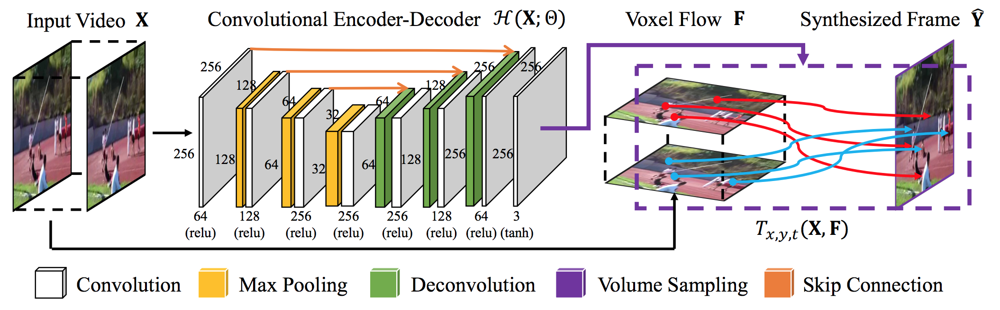
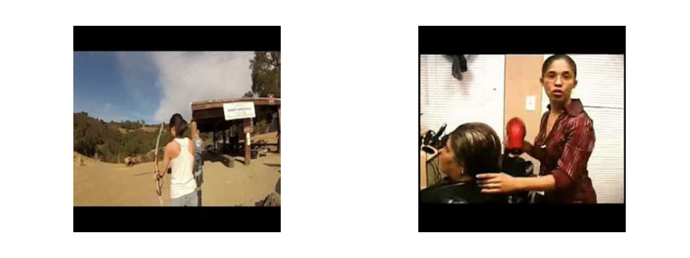

# Video Frame Synthesis using Deep Voxel Flow




[[Project]](https://liuziwei7.github.io/projects/VoxelFlow) [[Paper]](https://arxiv.org/abs/1702.02463) [[Demo]](https://liuziwei7.github.io/projects/voxelflow/demo.html) [[Model]](https://drive.google.com/file/d/1FB-mpS4UokiLriDBNJSBmozMQRH0Qez1/view) 

## Install
```bash
cd core/ops/sync_bn
./build.sh
```

## Training
```bash
python train.py configs/voxel-flow.py
```

## Download Pre-trained Model
We provide our pre-trained model of "Deep Voxel Flow" at [[Google Drive]](https://drive.google.com/file/d/1FB-mpS4UokiLriDBNJSBmozMQRH0Qez1/view), which achieves a comparable performance as reported in the paper. 

## Sample Results



## TODOs
  - [x] Training Data Preparation Code
  - [x] Add Pre-trained Model
  - [ ] Evaluation Code

## Contact
For any question, feel free to contact
```
Xiaoxiao Li : lxx1991@gmail.com
```

## License and Citation
The use of this software is RESTRICTED to **non-commercial research and educational purposes**.

```
@inproceedings{liu2017voxelflow,
 author = {Ziwei Liu, Raymond Yeh, Xiaoou Tang, Yiming Liu, and Aseem Agarwala},
 title = {Video Frame Synthesis using Deep Voxel Flow},
 booktitle = {Proceedings of International Conference on Computer Vision (ICCV)},
 month = {October},
 year = {2017} 
}
```
